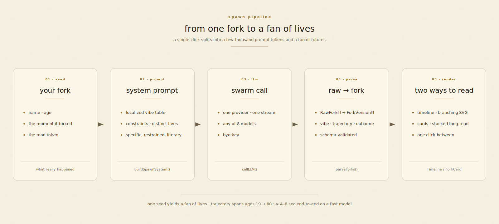
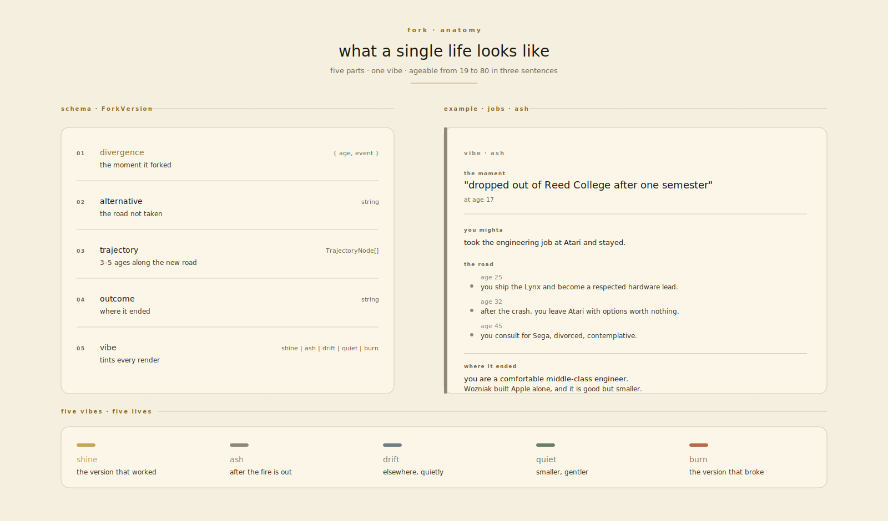
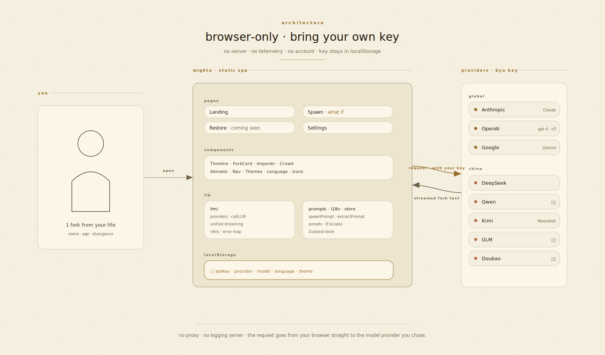
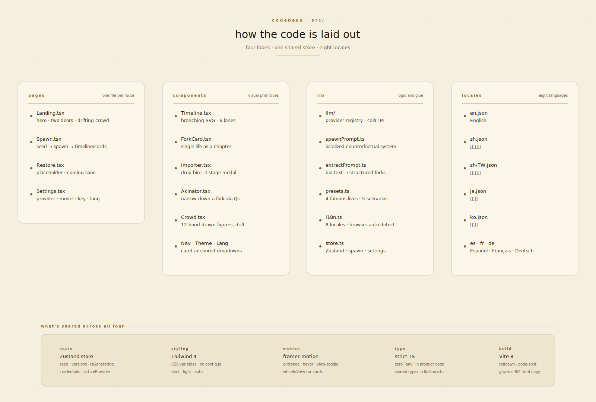

<div align="center">

<picture>
  <source media="(prefers-color-scheme: dark)" srcset="./docs/hero-dark.png">
  
</picture>

# mighta

### _你没活过的那些人生。_

一个由群体 LLM agent 驱动的反事实人生模拟器。<br>
你给它几个真实的人生岔路 ——<br>
它孵化出六个走了另一条路的"你"。

<br>

<p>
  <a href="https://yunyueli.github.io/Mighta/"></a>
  <a href="https://github.com/YunyueLi/Mighta/stargazers"></a>
  <a href="./LICENSE"></a>
  
  
  
</p>

<p>
  <a href="https://yunyueli.github.io/Mighta/"><b>🚀 立刻试用 →</b></a> ·
  <a href="#-特性">特性</a> ·
  <a href="#-怎么跑起来">怎么跑起来</a> ·
  <a href="#%EF%B8%8F-架构">架构</a> ·
  <a href="#-快速开始">快速开始</a> ·
  <a href="#-截图">截图</a> ·
  <a href="./README.md"><b>English</b></a>
</p>

</div>

<br>

<div align="center">

> _"林中有两条路,而我 ——<br>我选了人迹更少的那条。"_<br>
> <sub>**Robert Frost** · _The Road Not Taken_</sub>

</div>

<br>

## ✨ 这是什么

`mighta` 是一个开源的、**纯浏览器端**运行的反事实人生模拟器。

你给它你人生中真实的岔路 —— 那些你做了 A 但本可能做 B 的时刻。一群 LLM agent 会孵化出六个走了另一条路的"你",让他们沿着各自的轨迹老去,然后告诉你每一个最后变成了什么样。

这是"你,在另一种人生里" —— **具体、克制、文学**。不是星座算命,不是聊天机器人。是对那条没走的路的安静凝视,可视化。

<br>

<table>
  <tr>
    <td width="50%">
      <h3>🌀 孵化你自己。</h3>
      一千个走了另一条的你,在那里慢慢老去。看其中六个。
    </td>
    <td width="50%">
      <h3>📜 还原已逝之物。</h3>
      <em>(即将到来)</em> 还原失落的结局、沦陷之城、被涂黑的档案。
    </td>
  </tr>
</table>

<br>

## 🎯 特性

<table>
<tr>
<td width="33%" valign="top">

#### 🌳 分支时间轴
git-graph 风的 SVG 可视化。六条人生线从你的"现在"分叉,各自走向不同的未来。

</td>
<td width="33%" valign="top">

#### 🌐 自带模型
Anthropic · OpenAI · Gemini · DeepSeek · 通义 · Kimi · GLM · 豆包

</td>
<td width="33%" valign="top">

#### 🌍 八种语言
英 · 简中 · 繁中 · 日 · 韩 · 西 · 法 · 德 —— Claude 用你的语言回答。

</td>
</tr>
<tr>
<td width="33%" valign="top">

#### ☀️ 明暗主题
暖深 cinematic · 暖米 parchment · 跟随系统。色彩平滑过渡。

</td>
<td width="33%" valign="top">

#### 📥 导入任意文本
拖入 `.txt` / `.md`(或粘贴),Claude 自动提取人生岔路。

</td>
<td width="33%" valign="top">

#### ⏱ 细颗粒度时间
"我 22 岁那个秋天" / "上周" —— 不只是整数年龄。

</td>
</tr>
<tr>
<td width="33%" valign="top">

#### 🎭 分叉情绪标记
每个 fork 自带 vibe 标签:<strong>绽放</strong> · <strong>灰烬</strong> · <strong>漂流</strong> · <strong>安静</strong> · <strong>燃烧</strong>。

</td>
<td width="33%" valign="top">

#### 🎨 Editorial 美学
Fraunces 衬线 · Caveat 手写体 · CJK 用 Noto · 手绘人群。

</td>
<td width="33%" valign="top">

#### 🔒 隐私优先
密钥只留在浏览器。没有服务器、没有埋点、不需要账号、零数据收集。

</td>
</tr>
</table>

<br>

## 🌀 怎么跑起来

一个 seed，五个阶段，一扇人生的扇面。一次点击拆成几千个 prompt token，再聚成 6 个结构化的 `ForkVersion` —— 每一个都能从 19 岁活到 80 岁。

<picture>
  <source media="(prefers-color-scheme: dark)" srcset="./docs/diagram-spawn-flow-dark.svg">
  
</picture>

<br>

## 🧬 一个 fork 的解剖

每一个版本的你都是 **五个字段、一种 vibe** —— 严格的 schema，让 LLM 不漂、让 timeline 和卡片渲染一致。

<picture>
  <source media="(prefers-color-scheme: dark)" srcset="./docs/diagram-fork-anatomy-dark.svg">
  
</picture>

<br>

## 🚀 快速开始

```bash
git clone https://github.com/YunyueLi/Mighta.git
cd Mighta
npm install
npm run dev
```

然后打开 [`http://localhost:5173`](http://localhost:5173):

1. 点右上角 **⚙ 设置** 齿轮
2. 选 **模型提供商** —— 按地区:
   - 🌐 **海外**: Anthropic · OpenAI · Gemini
   - 🇨🇳 **国内**: DeepSeek · 通义 · Kimi · GLM · 豆包
3. 粘贴你的 **API 密钥**([去拿一个 →](https://platform.deepseek.com/api_keys))
4. 选 **模型** —— Haiku 4.5 便宜快; Sonnet 4.6 更深思
5. 进入"**如果**"页,试一下预设(从 **史蒂夫·乔布斯** 开始),或者贴你自己的故事 → **看看本可能的样子**

<br>

## 🎨 截图

<table>
<tr>
<td width="50%">
<a href="./docs/landing-dark.png"></a>
<p align="center"><sub>主页 — 暗色</sub></p>
</td>
<td width="50%">
<a href="./docs/landing-light.png"></a>
<p align="center"><sub>主页 — 亮色</sub></p>
</td>
</tr>
<tr>
<td width="50%">
<a href="./docs/timeline.png"></a>
<p align="center"><sub>如果 — 分支时间轴</sub></p>
</td>
<td width="50%">
<a href="./docs/cards.png"></a>
<p align="center"><sub>如果 — 卡片视图</sub></p>
</td>
</tr>
<tr>
<td width="50%">
<a href="./docs/importer.png"></a>
<p align="center"><sub>导入任意文本 · 三阶段流程</sub></p>
</td>
<td width="50%">
<a href="./docs/settings.png"></a>
<p align="center"><sub>设置 — 8 个提供商,自带密钥</sub></p>
</td>
</tr>
</table>

<br>

## 🔧 技术栈

<p>
  
  
  
  
  
  
  
  
  
</p>

**类型系统:** strict TS · 业务代码零 `any`<br>
**打包:** Vite 8 + Tailwind 4(CSS-first 配置,无需 `tailwind.config.js`)<br>
**状态:** Zustand 管全局 + react-i18next 8 种语言 + framer-motion 入场/悬停动效<br>
**LLM:** OpenAI SDK + Anthropic SDK,通过统一的 `lib/llm/` 抽象 —— 切换 provider 不需要碰功能代码<br>
**字体:** Fraunces(可变 serif) + Caveat(手写) + Inter(sans) + JetBrains Mono + Noto Sans/Serif(SC · JP · KR)

<br>

## 🏗 架构

一个静态 SPA，**中间没有服务器**。你的 key、你的模型、你的文本 —— 请求从浏览器直接打到你选的那家 provider。

<picture>
  <source media="(prefers-color-scheme: dark)" srcset="./docs/diagram-architecture-dark.svg">
  
</picture>

<br>

## 📁 代码结构

四叶（`pages` · `components` · `lib` · `locales`），共用一个 Zustand store 和一套 Tailwind 4 表层。

<picture>
  <source media="(prefers-color-scheme: dark)" srcset="./docs/diagram-codebase-dark.svg">
  
</picture>

<br>

## 🌍 语言

mighta 会**八种语言**—— UI _和_ LLM 输出都跟着切换:

| 语言 | 本地名 | UI | Claude 用此语言回答 |
|---|---|:-:|:-:|
| English | English | ✓ | ✓ |
| 简体中文 | Simplified Chinese | ✓ | ✓ |
| 繁體中文 | Traditional Chinese | ✓ | ✓ |
| 日本語 | Japanese | ✓ | ✓ |
| 한국어 | Korean | ✓ | ✓ |
| Español | Spanish | ✓ | ✓ |
| Français | French | ✓ | ✓ |
| Deutsch | German | ✓ | ✓ |

浏览器语言自动检测。Nav 上的语言下拉,或者 Settings 里手动切换。

<br>

## 🔌 提供商

<table>
<tr>
<td><b>🌐 海外</b></td>
<td>
<a href="https://console.anthropic.com">Anthropic Claude</a> ·
<a href="https://platform.openai.com">OpenAI</a> ·
<a href="https://aistudio.google.com">Google Gemini</a>
</td>
</tr>
<tr>
<td><b>🇨🇳 国内</b></td>
<td>
<a href="https://platform.deepseek.com">DeepSeek</a> ·
<a href="https://bailian.console.aliyun.com">通义千问 Qwen</a> ·
<a href="https://platform.moonshot.cn">Moonshot Kimi</a> ·
<a href="https://bigmodel.cn">智谱 GLM</a> ·
<a href="https://www.volcengine.com">豆包 Doubao</a>
</td>
</tr>
</table>

所有 provider 都是**自带密钥**模式。密钥存在你浏览器的 `localStorage`,不上传任何服务器。

<br>

## 🔒 隐私

> **你的密钥从不离开你的浏览器。**

mighta 是一个**纯静态 SPA**。没有后端、没有服务器、没有埋点、不需要账号。
请求路径:**浏览器 → 模型提供商,直连**。

源码全部公开。自己审,自己信。

<br>

## 🗺 路线图

- [x] **如果**模块 —— 6 条平行人生 + 分支时间轴
- [x] **8 个 provider** —— Anthropic + OpenAI + Gemini + 5 个国内 provider
- [x] **8 种语言** —— UI + LLM 输出,自动检测
- [x] **明 / 暗 / 自动**主题
- [x] **文件导入** —— 拖入文本,Claude 自动提取节点
- [x] **细颗粒度时间** —— `moment` 字段("上周" / "2019 年 10 月")
- [ ] **残章**模块 —— 还原失落的结局、被涂黑的档案、沦陷之城
- [ ] **分享** —— 把 fork 导出为图片 / 链接 / OG card
- [ ] **再分叉** —— 从一个 fork 再分叉(递归 what-if)
- [ ] **收藏** —— 保存历史 fork
- [ ] **托管 demo** —— 带限流的免费试用 key

<br>

## ⭐ Star 历史

<a href="https://star-history.com/#YunyueLi/Mighta&Date">
  <picture>
    <source media="(prefers-color-scheme: dark)" srcset="https://api.star-history.com/svg?repos=YunyueLi/Mighta&type=Date&theme=dark">
    
  </picture>
</a>

<br>

## 🤝 贡献

欢迎 Issue 和 PR。最简单的贡献:**加一个 preset**(~5 分钟)。

一个新名人(`category: "famous"`)或情境(`category: "scenario"`)直接加到 [`src/lib/presets.ts`](./src/lib/presets.ts)。再在八个 locale 文件加上名字翻译就行。

详见 [CONTRIBUTING.md](./CONTRIBUTING.md)(新语言、新 provider、新模块的指南)。

**风格:** 克制优于花哨 · 具体优于抽象 · 真实的岔路是"某个十月的周二",不是"22 岁"。

<br>

## 🎬 致敬

- **Robert Frost** —— _[未走的路](https://www.poetryfoundation.org/poems/44272/the-road-not-taken)_ · 源头
- **[The Public Domain Review](https://publicdomainreview.org)** · 纸与档案的美学
- **Anthropic.com** · 暖色克制的 editorial 表面
- **NYT Magazine, A24 films, Klim Type** · 字体
- **《滑动门》**(1998)& **《人生切割术》** · 反事实自我

<br>

## 📄 协议

[MIT](./LICENSE) © 2026 mighta 贡献者们

<br>

---

<div align="center">

<sub>由一群 LLM agent 推演 · 自带密钥 · 只留在你浏览器里</sub><br>
<sub>· · ·</sub><br>
<sub>如果 mighta 给你看到了一个你没料到的自己 —— <a href="https://github.com/YunyueLi/Mighta/stargazers">⭐ 给个 star</a>。</sub>

</div>
