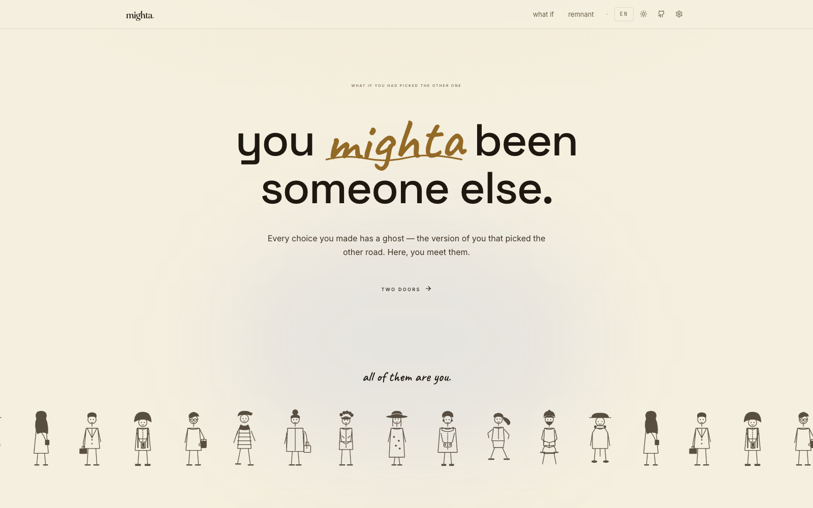

<div align="center">

<picture>
  <source media="(prefers-color-scheme: dark)" srcset="./docs/hero-dark.png">
  
</picture>

# mighta

### _the lives you didn't live._

A counterfactual life simulator powered by a swarm of LLM agents.<br>
You feed it a few real forks in your road.<br>
It spawns six versions of you that took the other one.

<br>

<p>
  <a href="https://github.com/YunyueLi/Mighta/stargazers"></a>
  <a href="./LICENSE"></a>
  
  
  
</p>

<p>
  <a href="#-quick-start"><b>Quick Start</b></a> ·
  <a href="#-features">Features</a> ·
  <a href="#-screenshots">Screenshots</a> ·
  <a href="#%EF%B8%8F-roadmap">Roadmap</a> ·
  <a href="./README-zh.md"><b>简体中文</b></a>
</p>

</div>

<br>

<div align="center">

> _"Two roads diverged in a yellow wood, and I —<br>I took the one less traveled by."_<br>
> <sub>**Robert Frost** · _The Road Not Taken_</sub>

</div>

<br>

## ✨ What is mighta?

`mighta` is an open-source, **browser-only** counterfactual simulator.

You give it real forks from your life — moments where you went A but could have gone B. A swarm of LLM agents spawns six parallel-life versions, ages them through their own trajectories, and writes back what became of each one.

It's "you, in another life" — **specific, restrained, literary**. Not a horoscope. Not a chatbot. A quiet meditation on the road not taken, made visual.

<br>

<table>
  <tr>
    <td width="50%">
      <h3>🌀 Spawn yourself.</h3>
      A thousand of you took the other path and grew old there. See six of them.
    </td>
    <td width="50%">
      <h3>📜 Restore what's gone.</h3>
      <em>(coming soon)</em> Reconstruct lost endings, ruined cities, redacted files.
    </td>
  </tr>
</table>

<br>

## 🎯 Features

<table>
<tr>
<td width="33%" valign="top">

#### 🌳 Branching timeline
Git-graph style SVG. Six lifelines diverge from your root,<br>each curving into its own future.

</td>
<td width="33%" valign="top">

#### 🌐 Bring your own model
Anthropic · OpenAI · Gemini · DeepSeek · Qwen · Kimi · GLM · Doubao

</td>
<td width="33%" valign="top">

#### 🌍 Eight languages
EN · 简中 · 繁中 · 日本語 · 한국어 · ES · FR · DE — Claude responds in your language.

</td>
</tr>
<tr>
<td width="33%" valign="top">

#### ☀️ Light & dark
Warm cinematic dark · warm parchment light · system-auto. Smooth color transitions.

</td>
<td width="33%" valign="top">

#### 📥 Import any text
Drop a `.txt` / `.md` or paste a bio. Claude extracts your life into forks.

</td>
<td width="33%" valign="top">

#### ⏱ Granular time
"the autumn I was 22" / "last week" — not just integer ages.

</td>
</tr>
<tr>
<td width="33%" valign="top">

#### 🎭 Vibe-typed forks
Each fork comes tinted: <strong>shine</strong>, <strong>ash</strong>, <strong>drift</strong>, <strong>quiet</strong>, or <strong>burn</strong>.

</td>
<td width="33%" valign="top">

#### 🎨 Editorial aesthetic
Fraunces serif · Caveat handwritten accents · Noto for CJK · hand-drawn crowd.

</td>
<td width="33%" valign="top">

#### 🔒 Privacy-first
Key stays in your browser. No server. No telemetry. No accounts. Zero data collection.

</td>
</tr>
</table>

<br>

## 🚀 Quick Start

```bash
git clone https://github.com/YunyueLi/Mighta.git
cd Mighta
npm install
npm run dev
```

Then open [`http://localhost:5173`](http://localhost:5173):

1. Click the **⚙ settings** gear (top-right)
2. Pick a **model provider** — choose by region:
   - 🌐 **Global**: Anthropic · OpenAI · Gemini
   - 🇨🇳 **China**: DeepSeek · Qwen · Kimi · GLM · Doubao
3. Paste your **API key** ([get one →](https://console.anthropic.com/settings/keys))
4. Pick a **model** — Haiku 4.5 is cheap and fast; Sonnet 4.6 is sharper
5. Go to **what if**, try a preset (start with **Steve Jobs**), or paste your own story → **spawn**

<br>

## 🎨 Screenshots

<table>
<tr>
<td width="50%">
<a href="./docs/landing-dark.png"></a>
<p align="center"><sub>Landing — dark</sub></p>
</td>
<td width="50%">
<a href="./docs/landing-light.png"></a>
<p align="center"><sub>Landing — light</sub></p>
</td>
</tr>
<tr>
<td width="50%">
<a href="./docs/timeline.png"></a>
<p align="center"><sub>Spawn — branching timeline</sub></p>
</td>
<td width="50%">
<a href="./docs/cards.png"></a>
<p align="center"><sub>Spawn — cards view</sub></p>
</td>
</tr>
<tr>
<td width="50%">
<a href="./docs/importer.png"></a>
<p align="center"><sub>Import any bio · 3-stage flow</sub></p>
</td>
<td width="50%">
<a href="./docs/settings.png"></a>
<p align="center"><sub>Settings — 8 providers, BYO key</sub></p>
</td>
</tr>
</table>

<br>

## 🔧 Stack

<p>
  
  
  
  
  
  
  
  
  
</p>

**Type system:** strict TS · zero `any` in product code.<br>
**Bundling:** Vite 8 with Tailwind 4 (CSS-first config, no `tailwind.config.js`).<br>
**State:** Zustand for app state + react-i18next for 8 locales + framer-motion for entrance / hover.<br>
**LLM:** OpenAI SDK + Anthropic SDK unified through one `lib/llm/` abstraction — swap providers without touching feature code.<br>
**Typography:** Fraunces (variable serif) + Caveat (handwritten) + Inter (sans) + JetBrains Mono + Noto Sans/Serif (SC · JP · KR).

<br>

## 🏗 Architecture

```
src/
├── pages/
│   ├── Landing.tsx       editorial hero + two doors + drifting crowd
│   ├── Spawn.tsx         what if: seed → spawn → timeline / cards
│   ├── Restore.tsx       remnant (placeholder, coming soon)
│   └── Settings.tsx      provider · model · key · language · theme
├── components/
│   ├── Timeline.tsx      SVG branching tree, hover detail panel
│   ├── ForkCard.tsx      one fork as a card
│   ├── Importer.tsx      3-stage modal: input → parsing → preview
│   ├── Crowd.tsx         12 hand-drawn figures, slow drift
│   ├── LanguageSwitch.tsx, ThemeSwitch.tsx (caret-anchored dropdowns)
│   └── Icons.tsx         inline SVG, currentColor (no icon lib)
├── lib/
│   ├── llm/              provider registry + unified callLLM
│   ├── spawnPrompt.ts    localized counterfactual system prompt
│   ├── extractPrompt.ts  bio text → structured forks
│   ├── presets.ts        4 famous lives + 5 scenarios
│   ├── i18n.ts           8 locales, browser auto-detect
│   └── store.ts          Zustand
└── locales/
    └── {en, zh, zh-TW, ja, ko, es, fr, de}.json
```

<br>

## 🌍 Languages

mighta speaks **eight** — the UI _and_ the LLM output adapt:

| Lang | Native | UI | Claude responds in |
|---|---|:-:|:-:|
| English | English | ✓ | ✓ |
| 简体中文 | Simplified Chinese | ✓ | ✓ |
| 繁體中文 | Traditional Chinese | ✓ | ✓ |
| 日本語 | Japanese | ✓ | ✓ |
| 한국어 | Korean | ✓ | ✓ |
| Español | Spanish | ✓ | ✓ |
| Français | French | ✓ | ✓ |
| Deutsch | German | ✓ | ✓ |

Browser language is auto-detected. Switch from the language dropdown in nav, or in Settings.

<br>

## 🔌 Providers

<table>
<tr>
<td><b>🌐 Global</b></td>
<td>
<a href="https://console.anthropic.com">Anthropic Claude</a> ·
<a href="https://platform.openai.com">OpenAI</a> ·
<a href="https://aistudio.google.com">Google Gemini</a>
</td>
</tr>
<tr>
<td><b>🇨🇳 China</b></td>
<td>
<a href="https://platform.deepseek.com">DeepSeek</a> ·
<a href="https://bailian.console.aliyun.com">Qwen (通义千问)</a> ·
<a href="https://platform.moonshot.cn">Moonshot Kimi</a> ·
<a href="https://bigmodel.cn">智谱 GLM</a> ·
<a href="https://www.volcengine.com">豆包 Doubao</a>
</td>
</tr>
</table>

All providers are **bring-your-own-key**. Your key lives in `localStorage`, not on any server.

<br>

## 🔒 Privacy

> **Your key never leaves your browser.**

mighta is a **static SPA**. No backend. No server. No telemetry. No account.
Requests go: **browser → model provider, directly.**

If you can read the source, you can verify it.

<br>

## 🗺 Roadmap

- [x] **Spawn** module — 6 parallel-life forks + branching timeline
- [x] **8 providers** — Anthropic + OpenAI + Gemini + 5 China providers
- [x] **8 languages** — UI + LLM output, auto-detected
- [x] **Light / Dark / Auto** theme
- [x] **File import** — drag text, Claude extracts forks
- [x] **Granular time** — `moment` field ("last week" / "Oct 2019")
- [ ] **Restore** module — reconstruct lost endings, redacted files, ruined cities
- [ ] **Share** — export a fork as image / link / OG card
- [ ] **Re-fork** — spawn forks of a fork (recursive what-ifs)
- [ ] **Library** — save & revisit your forks
- [ ] **Hosted demo** with rate-limited trial key

<br>

## ⭐ Star History

<a href="https://star-history.com/#YunyueLi/Mighta&Date">
  <picture>
    <source media="(prefers-color-scheme: dark)" srcset="https://api.star-history.com/svg?repos=YunyueLi/Mighta&type=Date&theme=dark">
    
  </picture>
</a>

<br>

## 🤝 Contributing

Issues and PRs welcome. The easiest contribution: **add a preset** (~5 min).

A new famous life (`category: "famous"`) or scenario (`category: "scenario"`) goes into [`src/lib/presets.ts`](./src/lib/presets.ts). Just add the entry + the name translation in eight locale files.

See [CONTRIBUTING.md](./CONTRIBUTING.md) for the longer guide (new languages, new providers, new modules).

**Style:** restraint over flair · concrete over abstract · a real fork happens on a Tuesday in October, not "age 22".

<br>

## 🎬 Inspired by

- **Robert Frost** — _[The Road Not Taken](https://www.poetryfoundation.org/poems/44272/the-road-not-taken)_ · the source
- **[The Public Domain Review](https://publicdomainreview.org)** · paper & archive aesthetic
- **Anthropic.com** · warm restrained editorial surface
- **NYT Magazine, A24 films, Klim Type** · typography
- **_Sliding Doors_** (1998) & **_Severance_** · the counterfactual self

<br>

## 📄 License

[MIT](./LICENSE) © 2026 mighta contributors

<br>

---

<div align="center">

<sub>built with a swarm of LLM agents · bring your own key · stays in your browser</sub><br>
<sub>· · ·</sub><br>
<sub>If mighta showed you a version of yourself you didn't expect — <a href="https://github.com/YunyueLi/Mighta/stargazers">⭐ star the repo</a>.</sub>

</div>
