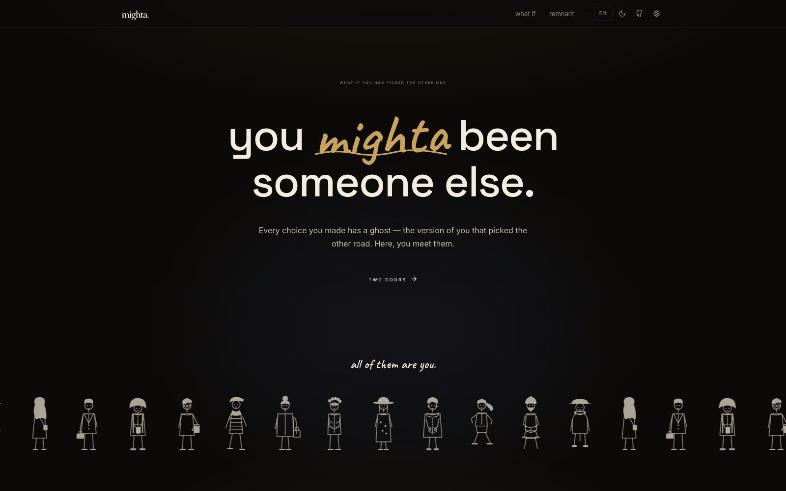
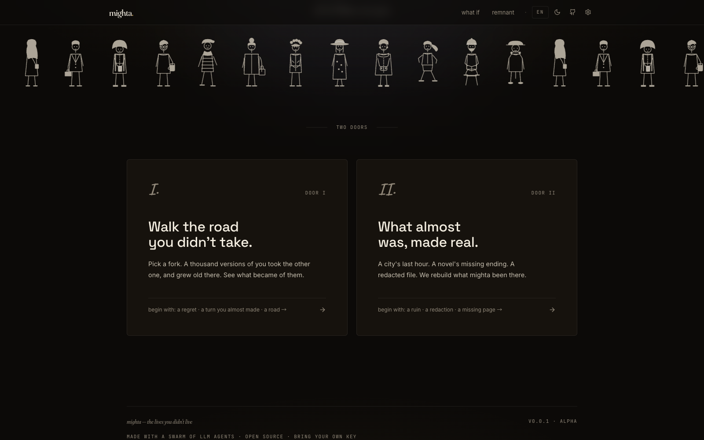
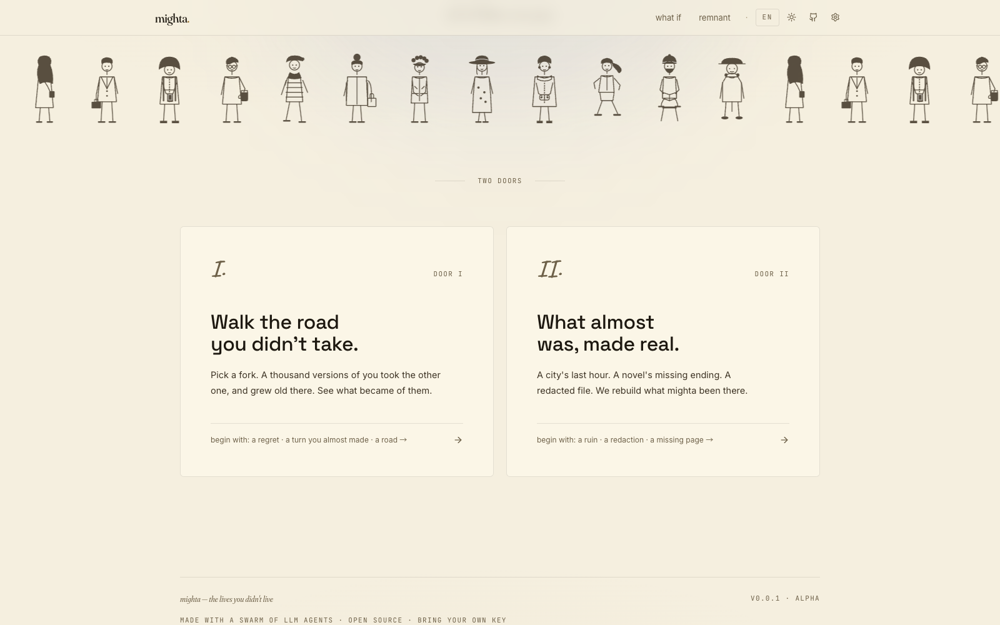
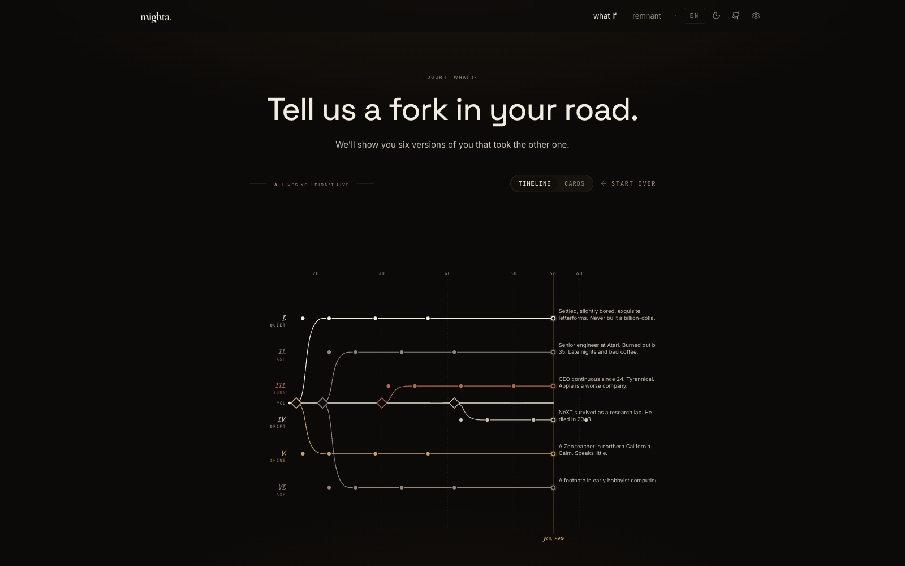
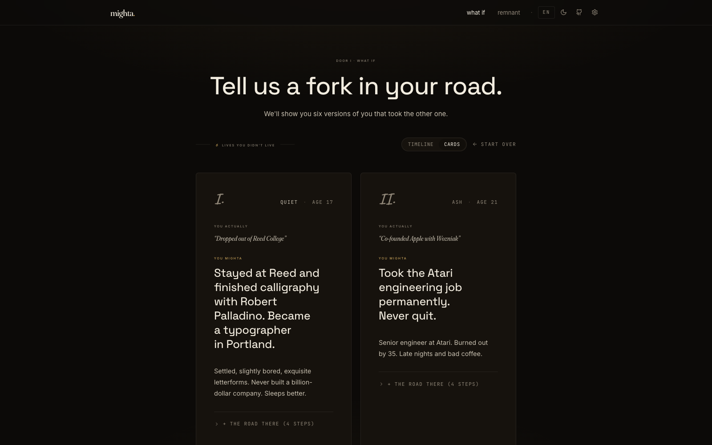
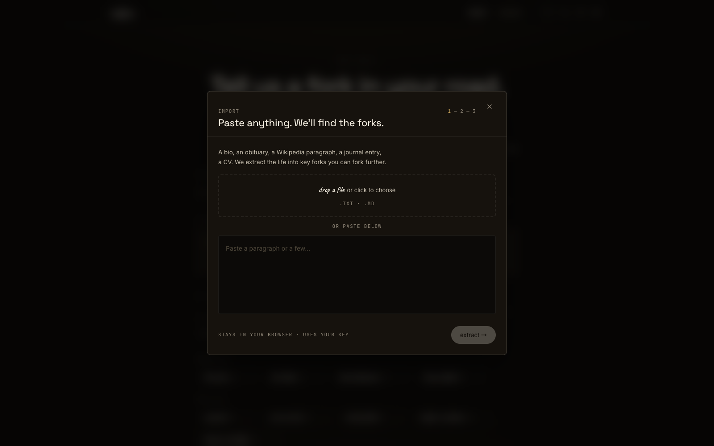
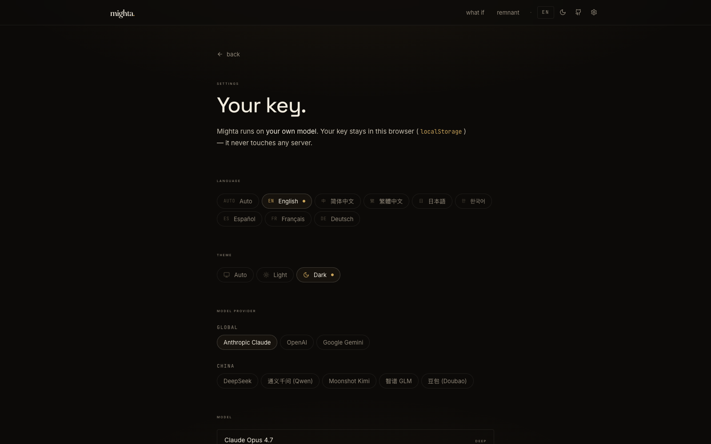

<div align="center">

# mighta

### _the lives you didn't live._

**A counterfactual life simulator powered by a swarm of LLM agents.**

You feed it a few real forks in your road. A swarm of agents spawns six versions of you that took the other one, ages them through time, and writes back what became of them.

[**English**](#english) · [**中文**](./README-zh.md) · [Live Demo](#) · [Screenshots](#screenshots)



</div>

---

## English

### What is this?

`mighta` is an open-source, browser-only **counterfactual simulator**.

You give it real forks from your life — moments where you went A but could have gone B. The model spawns six parallel-life versions, ages them through their own trajectories, and tells you what became of each one.

It's "you, in another life" — but specific, restrained, literary. Not a horoscope. Not a chatbot. A quiet meditation on the road not taken, made visual.

> _Pick a fork. A thousand of you took the other one, and grew old there. See what became of them._

### Features

| Feature | What it does |
|---|---|
| 🌀 **Spawn** | Generate 6 parallel-life forks from any moment in your past |
| 📜 **Restore** | _(coming soon)_ Reconstruct lost endings, ruined cities, redacted files |
| 🌳 **Branching timeline** | Git-graph–style SVG visualization with hover details + expandable forks |
| 🌐 **Bring your own model** | Anthropic Claude · OpenAI · Gemini · DeepSeek · Qwen · Kimi · GLM · Doubao |
| 🌍 **8 languages** | English · 简体中文 · 繁體中文 · 日本語 · 한국어 · Español · Français · Deutsch |
| ☀️ **Light & dark** | warm cinematic dark · warm parchment light · system-auto |
| 📥 **Import any text** | Drop a `.txt`/`.md` (or paste) — agents extract your life into forks |
| ⏱ **Granular time** | "the autumn I was 22" / "last week" — not just integer ages |
| 🔒 **Privacy-first** | Key stays in your browser. No server. No telemetry. No accounts. |

### Quick start

```bash
git clone https://github.com/YunyueLi/mighta.git
cd mighta
npm install
npm run dev
# open http://localhost:5173
```

Then:

1. Click the **settings** gear (top-right)
2. Pick a **model provider** (Anthropic, OpenAI, Gemini, or any of the China providers)
3. Paste your **API key** ([get one here](https://console.anthropic.com/settings/keys))
4. Pick a **model** (Haiku 4.5 is cheap and fast; Sonnet 4.6 is sharper)
5. Go to `what if`, drop in a preset (try **Steve Jobs**) or paste your own bio, click **spawn**.

### Privacy

Your API key stays in your browser's `localStorage`. **Direct browser → model provider.**
No server. No telemetry. No accounts. No data collection.

If you can read the source, you can verify it. It's all client-side React.

### Stack

- **React 19** + **TypeScript** + **Vite 8**
- **Tailwind CSS 4** (CSS-first config, no `tailwind.config.js`)
- **Zustand** (state) · **react-i18next** (8 locales) · **framer-motion** (animation)
- **OpenAI SDK** + **Anthropic SDK** (unified `llm.ts` abstraction)
- **Fraunces** (variable serif) + **Caveat** (handwritten script) + **Inter** (sans) + **JetBrains Mono** + **Noto Sans/Serif SC/JP/KR** (CJK)

### Architecture

```
src/
├── pages/
│   ├── Landing.tsx       # editorial hero + two doors
│   ├── Spawn.tsx         # what if: form → 6 forks → timeline / cards
│   ├── Restore.tsx       # remnant (placeholder)
│   └── Settings.tsx      # provider/model/key/language/theme
├── components/
│   ├── Timeline.tsx      # SVG branching tree with hover detail
│   ├── ForkCard.tsx      # one fork rendered as a card
│   ├── Importer.tsx      # 3-stage file/text import modal
│   ├── Crowd.tsx         # 12 hand-drawn drifting people
│   ├── LanguageSwitch.tsx # 8-lang dropdown
│   └── ThemeSwitch.tsx   # light/dark/auto dropdown
├── lib/
│   ├── llm/              # provider registry + unified callLLM
│   ├── spawnPrompt.ts    # localized counterfactual system prompt
│   ├── extractPrompt.ts  # bio → structured nodes
│   ├── presets.ts        # 4 famous lives + 5 scenarios
│   ├── i18n.ts           # 8 locales
│   └── store.ts          # Zustand
└── locales/
    └── {en,zh,zh-TW,ja,ko,es,fr,de}.json
```

### Screenshots

> _Drop your screenshots into `docs/` and they'll render below._

| Landing — dark | Landing — light |
|---|---|
|  |  |

| Spawn — timeline view | Spawn — cards view |
|---|---|
|  |  |

| Import (drag a CV / bio / Wikipedia para) | Settings — 8 providers |
|---|---|
|  |  |

### Roadmap

- [x] Spawn module (6 forks + branching timeline)
- [x] 8 providers (Anthropic + OpenAI + Gemini + 5 China)
- [x] 8 languages + auto-detect
- [x] Light / Dark / Auto
- [x] File import → Claude extracts forks
- [x] Granular time (`moment` field: "last week" / "Oct 2019")
- [ ] **Restore** module — reconstruct lost text/history/redacted files
- [ ] **Share** — export a fork as image / link
- [ ] **Re-fork** — spawn forks of a fork (recursive what-ifs)
- [ ] **Library** — save & revisit your forks
- [ ] **Hosted demo** with rate-limited free trial key

### Contributing

Issues + PRs welcome. See [CONTRIBUTING.md](./CONTRIBUTING.md).

If you build a `mighta` demo with an interesting preset (a historical figure, a regional scenario, a fictional character), open a PR adding it to `src/lib/presets.ts`.

### Inspired by

- **[The Public Domain Review](https://publicdomainreview.org)** — paper / archive aesthetic
- **Anthropic.com** — warm restrained editorial surface
- **NYT Magazine, A24 films, Klim Type** — typography reference
- **[Robert Frost — _The Road Not Taken_](https://www.poetryfoundation.org/poems/44272/the-road-not-taken)** — the source

### License

MIT © 2026 mighta contributors

---

<div align="center">

_built with a swarm of LLM agents · bring your own key · stays in your browser_

</div>
